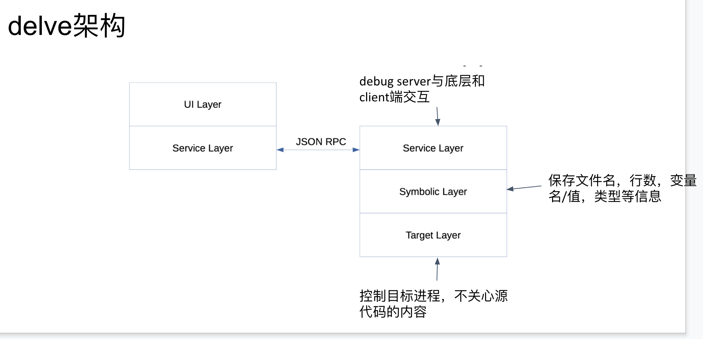

#  delve 修改golang返回值原理介绍

delve采用ptrace的方式attach上目标进程，在目标函数返回处设置断点，当程序触发断点时调用delve修改函数返回值即可。

##  前置基础

###  golang函数调用的参数传递

golang采用**栈帧**进行参数和返回值的传递，所以golang支持多返回值；

而c/c++采用**寄存器**进行参数和返回值的传递，所以c/c++只支持单返回值。

具体而言，可以简单分析一下以下函数的调用过程：

```go
package main

func f(a, b int) (int, int) {
    return a + b, a - b
}
func main() {
    f(66, 77)
}
```

其汇编代码对应如下，main函数

```assembly
"".main STEXT size=68 args=0x0 locals=0x28
	0x0000 00000 (main.go:7)	MOVQ	(TLS), CX
	0x0009 00009 (main.go:7)	CMPQ	SP, 16(CX)
	0x000d 00013 (main.go:7)	JLS	61
	0x000f 00015 (main.go:7)	SUBQ	$40, SP      // 分配 40 字节栈空间
	0x0013 00019 (main.go:7)	MOVQ	BP, 32(SP)   // 将基址指针存储到栈上
	0x0018 00024 (main.go:7)	LEAQ	32(SP), BP
	0x001d 00029 (main.go:8)	MOVQ	$66, (SP)    // 第一个参数
	0x0025 00037 (main.go:8)	MOVQ	$77, 8(SP)   // 第二个参数
	0x002e 00046 (main.go:8)	CALL	"".f(SB)
	0x0033 00051 (main.go:9)	MOVQ	32(SP), BP
	0x0038 00056 (main.go:9)	ADDQ	$40, SP
	0x003c 00060 (main.go:9)	RET
```

f函数

```assembly
"".f STEXT nosplit size=49 args=0x20 locals=0x0
	0x0000 00000 (main.go:3)	MOVQ	$0, "".~r2+24(SP) // 初始化第一个返回值
	0x0009 00009 (main.go:3)	MOVQ	$0, "".~r3+32(SP) // 初始化第二个返回值
	0x0012 00018 (main.go:4)	MOVQ	"".a+8(SP), AX    // AX = 66
	0x0017 00023 (main.go:4)	ADDQ	"".b+16(SP), AX   // AX = AX + 77 = 143
	0x001c 00028 (main.go:4)	MOVQ	AX, "".~r2+24(SP) // (24)SP = AX = 143
	0x0021 00033 (main.go:4)	MOVQ	"".a+8(SP), AX    // AX = 66
	0x0026 00038 (main.go:4)	SUBQ	"".b+16(SP), AX   // AX = AX - 77 = -11
	0x002b 00043 (main.go:4)	MOVQ	AX, "".~r3+32(SP) // (32)SP = AX = -11
	0x0030 00048 (main.go:4)	RET

```

**其中sp为堆栈指针**

不难看出，在main函数中调用f函数，经历了如下过程

1. 首先，main函数在栈上保存自己的返回地址base pointer，然后开辟了两段空间，分别存放调用f函数的参数和f函数的返回值：

   1. Sp + 16 ~ Sp + 32：保存f函数的两个返回值。
   2. Sp + 0  ~ Sp + 16：保存f函数的两个入参 

   

2. 其次，通过汇编指令CALL	"".f(SB)调用f函数。在f函数的调用过程中，他首先初始化

   Sp + 16 ~ Sp + 32 的两个返回值参数地址，经过一系列指令之后得到答案，并将值移

   动至Sp + 16 ~ Sp + 32的地址中进行返回。

   

3. main函数通过栈帧获取f函数的返回值，函数调用至此结束。

###  总结

相对于c/c++使用寄存器进行参数和返回值的传递，go选择使用栈帧进行参数和返回值的传递，这样做的好处有：

1. 不需要考虑超过寄存器数量的参数应该如何传递；
2. 不需要考虑不同架构上的寄存器差异；
3. 函数入参和出参的内存空间需要在栈上进行分配；

这样做也有一定坏处：

1. CPU 访问栈的开销比访问寄存器高几十倍；
2. 对于我们的函数故障注入带来困难：修改返回值并不能直接修改寄存器，而需要定位返回值的内存地址。

**现在，我们知道了函数调用的返回值是如何传递的，那么我们也就可以通过计算栈帧的offset，获取一个函数调用的返回值地址，并通过一系列手段将其修改，从而达到修改返回值的目的。**


##  delve介绍

###  为什么用delve

delve是专门为go语言设计的调试器，底层代码均用go编写。
代码地址：https://github.com/go-delve/delve
使用delve的编辑器：Goland IDE, VSCode Go, vim-go 等。

**在上面的分析中，我们需要一个能够适应go语言特性的，并较为安全的工具，在函数调用即将结束的时候让进程停下来，修改掉函数的返回值。**

在c/c++中，gdb显然是一个不错的选择，而专为go而设计的delve则是更适合我们的选择。（**chaosblade修改c/c++程序的返回值的方式，就是通过运行gdb脚本实现的**）

###  怎么用delve

在官方的接口中，delve提供了一个基于json-rpc的rpc api接口，方便我们进行自动化的api测试。



代码位置：	https://github.com/go-delve/delve/tree/master/service

godoc文档：https://godoc.org/github.com/go-delve/delve/service/rpc2

​					https://godoc.org/github.com/go-delve/delve/service/api

在文档中我们可以看到，delve提供一个service和一个client:

* service可以通过ptrace的方式attach上目标进程，并监听端口；

* client可以通过json-rpc的方式，通过端口与service进行通信，发送请求，换句话说，所有的控制逻辑都在client端完成。

这样，我们的方案就清晰明了了：

1. **通过service端attach上目标进程，监听端口；**
2. **启动client端连接端口，寻找目标函数的返回值位置并设置断点；**
3. **client端调用continue，让程序运行直至断点处；**
4. **获取断点处的寄存器等信息，计算返回值的栈帧offset，将其修改成你想要的结果！**
5. **client端调用continue，让程序继续运行。**

方案就是如此简单，但是细节还有很多需要考虑，目前我们只实现一个例子：数据库查询异常，之后会根据需要做更多扩展。


